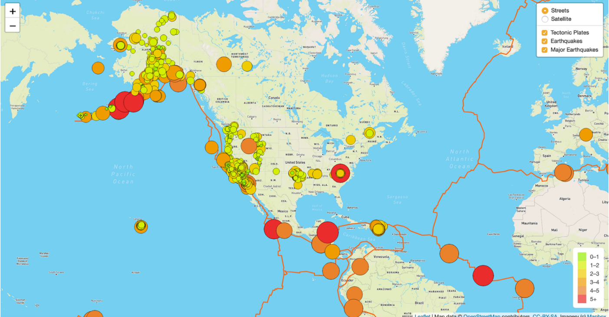
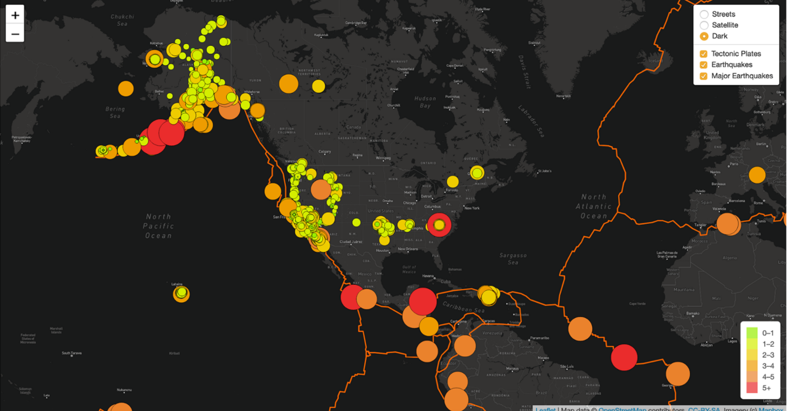

# Mapping_Earthquakes

## Summary
This project utilizes javascript, html and CSS to create interactive maps which display earthquake data.  The maps were created using GeoJSON earthquake data from the USGS website to display earthquake magnitude including the geographical coordinates of those earthquakes.  The Leaflet Javascript library was used to plot the data on a Mapbox map through an API request and create interactivity for the earthquake data.  The map interactivity allows the user to choose between Street view, Satellite view or Dark view and also allows the user to toggle on or off various features or filters including tectonic plates, earthquakes and major earthquakes.  

